# `ener_lgu` Database ERD

Generated from the live MySQL `ener_lgu` schema on 2026-07-16.

- 36 tables
- 35 enforced foreign-key relationships
- `PK` marks primary keys and `FK` marks columns backed by an actual MySQL foreign-key constraint.
- To keep the full-database diagram readable, each entity shows its key columns and a few identifying fields. The database remains the source of truth for the complete column definitions.

> **Mermaid Live Editor:** Copy everything inside the code block below, starting with the required `erDiagram` line. Do not copy only from `facilities {`, because Mermaid will report a diagram-type or parse error.

```mermaid
erDiagram
    facilities {
        bigint id PK
        varchar name
        varchar type
        varchar status
        bigint deleted_by
    }

    users {
        bigint id PK
        bigint facility_id FK
        varchar full_name
        varchar email
        varchar username
        varchar role
        varchar status
    }

    user_roles {
        bigint id PK
        varchar name
        varchar slug
        text permissions
        boolean is_system
    }

    facility_user {
        bigint id PK
        bigint user_id FK
        bigint facility_id FK
    }

    facility_audit_logs {
        bigint id PK
        bigint facility_id
        bigint performed_by
        varchar action
        varchar facility_name
    }

    facility_meters {
        bigint id PK
        bigint facility_id
        bigint parent_meter_id
        bigint approved_by_user_id
        varchar meter_name
        varchar meter_type
        varchar status
    }

    energy_profiles {
        bigint id PK
        bigint facility_id FK
        bigint primary_meter_id
        varchar electric_meter_no
        decimal baseline_kwh
    }

    energy_records {
        bigint id PK
        bigint facility_id FK
        bigint meter_id
        bigint recorded_by FK
        int year
        int month
        decimal actual_kwh
        decimal energy_cost
    }

    energy_incidents {
        bigint id PK
        bigint energy_record_id FK
        bigint facility_id
        bigint created_by
        varchar description
        varchar status
    }

    energy_incident_histories {
        bigint id PK
        bigint energy_record_id FK
        varchar alert_level
        decimal deviation
        varchar status
    }

    energy_actions {
        bigint id PK
        bigint facility_id FK
        varchar action_type
        varchar priority
        varchar status
        date target_date
    }

    main_meter_readings {
        bigint id PK
        bigint facility_id FK
        bigint encoded_by FK
        bigint approved_by FK
        date period_start_date
        date period_end_date
        decimal kwh_used
    }

    main_meter_baselines {
        bigint id PK
        bigint facility_id FK
        varchar baseline_type
        decimal baseline_kwh
        varchar computed_for_period
    }

    main_meter_alerts {
        bigint id PK
        bigint main_meter_reading_id FK
        bigint facility_id FK
        varchar alert_level
        decimal increase_percent
    }

    submeters {
        bigint id PK
        bigint facility_id FK
        varchar submeter_name
        varchar meter_type
        varchar status
    }

    submeter_readings {
        bigint id PK
        bigint submeter_id FK
        bigint encoded_by_user_id FK
        bigint approved_by_engineer_id FK
        varchar period_type
        decimal kwh_used
    }

    submeter_baselines {
        bigint id PK
        bigint submeter_id FK
        varchar baseline_type
        decimal baseline_value_kwh
        varchar computed_for_period
    }

    submeter_alerts {
        bigint id PK
        bigint submeter_reading_id FK
        bigint submeter_id FK
        varchar alert_level
        decimal increase_percent
    }

    submeter_equipments {
        bigint id PK
        bigint submeter_id FK
        bigint facility_meter_id FK
        varchar meter_scope
        varchar equipment_name
        int quantity
        decimal estimated_kwh
    }

    submeter_equipment_files {
        bigint id PK
        bigint submeter_equipment_id FK
        bigint submeter_id FK
        bigint facility_meter_id FK
        bigint uploaded_by FK
        varchar original_name
        varchar storage_path
    }

    maintenance {
        bigint id PK
        bigint facility_id FK
        bigint energy_record_id FK
        varchar issue_type
        varchar maintenance_status
        date scheduled_date
    }

    maintenance_history {
        bigint id PK
        bigint facility_id FK
        varchar issue_type
        varchar efficiency_rating
        varchar maintenance_status
        date completed_date
    }

    daily_checklist_items {
        bigint id PK
        bigint facility_id FK
        varchar issue_type
        varchar maintenance_status
        date scheduled_date
    }

    notifications {
        bigint id PK
        bigint user_id FK
        varchar title
        varchar type
        timestamp read_at
    }

    otps {
        bigint id PK
        bigint user_id FK
        varchar code
        timestamp expires_at
        boolean used
    }

    contact_messages {
        bigint id PK
        bigint read_by_user_id
        varchar name
        varchar email
        timestamp read_at
    }

    contact_message_replies {
        bigint id PK
        bigint contact_message_id FK
        bigint sent_by_user_id
        varchar recipient_email
        varchar send_status
    }

    audit_logs {
        bigint id PK
        bigint user_id
        varchar role
        varchar action
        varchar module
    }

    settings {
        bigint id PK
        varchar key
        text value
        varchar group
    }

    migrations {
        int id PK
        varchar migration
        int batch
    }

    password_reset_tokens {
        varchar email PK
        varchar token
        timestamp created_at
    }

    sessions {
        varchar id PK
        bigint user_id
        varchar ip_address
        int last_activity
    }

    jobs {
        bigint id PK
        varchar queue
        int attempts
        int available_at
    }

    failed_jobs {
        bigint id PK
        varchar uuid
        text connection
        text queue
        timestamp failed_at
    }

    cache {
        varchar key PK
        mediumtext value
        int expiration
    }

    cache_locks {
        varchar key PK
        varchar owner
        int expiration
    }

    facilities ||--o{ users : "assigned facility"
    facilities ||--o{ facility_user : has
    users ||--o{ facility_user : assigned

    facilities ||--o{ energy_profiles : profiles
    facilities ||--o{ energy_records : records
    users ||--o{ energy_records : records
    energy_records ||--o{ energy_incidents : incidents
    energy_records ||--o{ energy_incident_histories : history
    facilities ||--o{ energy_actions : actions

    facilities ||--o{ main_meter_readings : readings
    users ||--o{ main_meter_readings : encodes
    users ||--o{ main_meter_readings : approves
    facilities ||--o{ main_meter_baselines : baselines
    facilities ||--o{ main_meter_alerts : alerts
    main_meter_readings ||--o{ main_meter_alerts : triggers

    facilities ||--o{ submeters : submeters
    submeters ||--o{ submeter_readings : readings
    users ||--o{ submeter_readings : encodes
    users ||--o{ submeter_readings : approves
    submeters ||--o{ submeter_baselines : baselines
    submeters ||--o{ submeter_alerts : alerts
    submeter_readings ||--o{ submeter_alerts : triggers
    submeters ||--o{ submeter_equipments : equipment
    facility_meters ||--o{ submeter_equipments : equipment
    submeter_equipments ||--o{ submeter_equipment_files : files
    submeters ||--o{ submeter_equipment_files : files
    facility_meters ||--o{ submeter_equipment_files : files
    users ||--o{ submeter_equipment_files : uploads

    facilities ||--o{ maintenance : maintenance
    energy_records ||--o{ maintenance : source
    facilities ||--o{ maintenance_history : history
    facilities ||--o{ daily_checklist_items : checklist

    users ||--o{ notifications : receives
    users ||--o{ otps : owns
    contact_messages ||--o{ contact_message_replies : replies
```

## Important schema observations

The following columns behave like relationships in the Laravel application but currently have no enforced MySQL foreign-key constraint, so they are intentionally not drawn as relationship lines above:

- `audit_logs.user_id -> users.id`
- `contact_messages.read_by_user_id -> users.id`
- `contact_message_replies.sent_by_user_id -> users.id`
- `energy_incidents.facility_id -> facilities.id`
- `energy_incidents.created_by -> users.id`
- `energy_profiles.primary_meter_id -> facility_meters.id`
- `energy_records.meter_id -> facility_meters.id`
- `energy_records.deleted_by -> users.id`
- `facilities.deleted_by -> users.id`
- `facility_audit_logs.facility_id -> facilities.id`
- `facility_audit_logs.performed_by -> users.id`
- `facility_meters.facility_id -> facilities.id`
- `facility_meters.parent_meter_id -> facility_meters.id`
- `facility_meters.approved_by_user_id -> users.id`
- `facility_meters.deleted_by -> users.id`
- `sessions.user_id -> users.id`

These may be deliberate soft references, but they should be reviewed before adding constraints because existing orphaned records can cause a migration to fail.

## Standalone framework tables

These tables do not require ERD relationship lines:

- `cache`, `cache_locks`
- `jobs`, `failed_jobs`
- `migrations`
- `password_reset_tokens`
- `settings`
- `sessions` (its `user_id` is indexed but not constrained)
- `user_roles` (the application matches `users.role` to `user_roles.slug` rather than using a foreign key)
- `audit_logs` (its `user_id` is indexed but not constrained)
